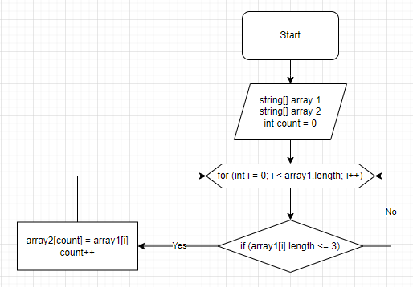

# Final_Task
## Задача : 
### Написать программу, которая из имеющегося массива строк формирует массив из строк, длина которых меньше либо равна 3 символа. Первоначальный массив можно ввести с клавиатуры, либо задать на старте выполнения алгоритма. При решение не рекомендуется пользоваться коллекциями, лучше обойтись исключительно массивами
## Примеры

Введите строку из слов, разделенных пробелами:

```sh 
hello world 123
```
Новый массив строк:
```sh
123
```
## Описание алгоритма решения:
### Сначала объявляется два массива: string[] array1 и string[] array2 аналогичный по длине, затем  устанавливаем счетчик int count = 0. Далее мы пишем чикл в котором прописываем перебор всей длинный массива array1.length с проверкой условия <=3 , при выполнении условия элемент [i] массива array1 записывается в count элемента [i] массива array2 и цикл повторяется. Если же условие не выполняется, то цикл перебирает следующий элемент [i] массива array1, пока тот не кончится.

### Графическое изображение блок - схемы метода

